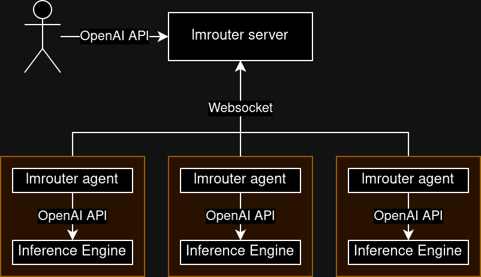

# lmrouter

Just like [AI Horde](https://stablehorde.net/) but specifically for low-latency
streaming text generation using ephemeral inference servers.

## How it works



lmrouter consists of two components, server and agent. Server acts as the hub,
and will route incoming inference requests to any available agent. Agents will
run in the inference server close to where the inference API is hosted.

The agents will be making an outbound websocket connection to the server, so
there is no need to port forward agent nodes.

## Usage

```sh
# Build the project
go build .

# Run the server
./lmrouter server --listen :9090

# Run the agent
./lmrouter agent --hub ws://localhost:9090 --inference http://localhost:5000
```
